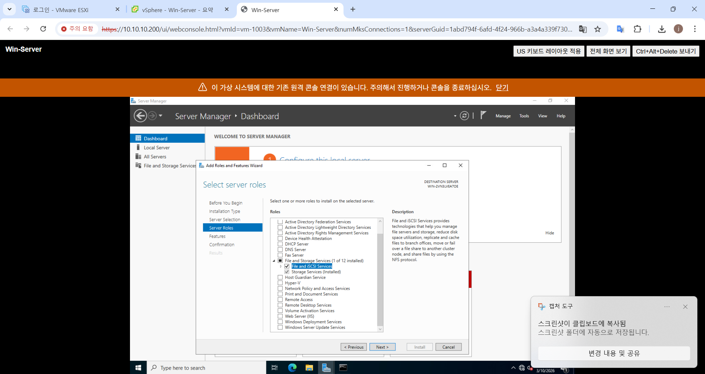
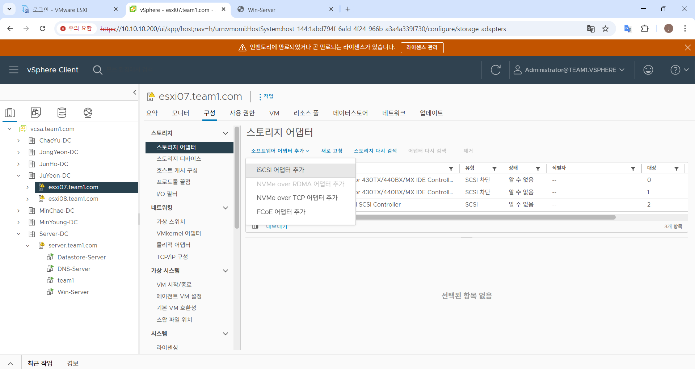
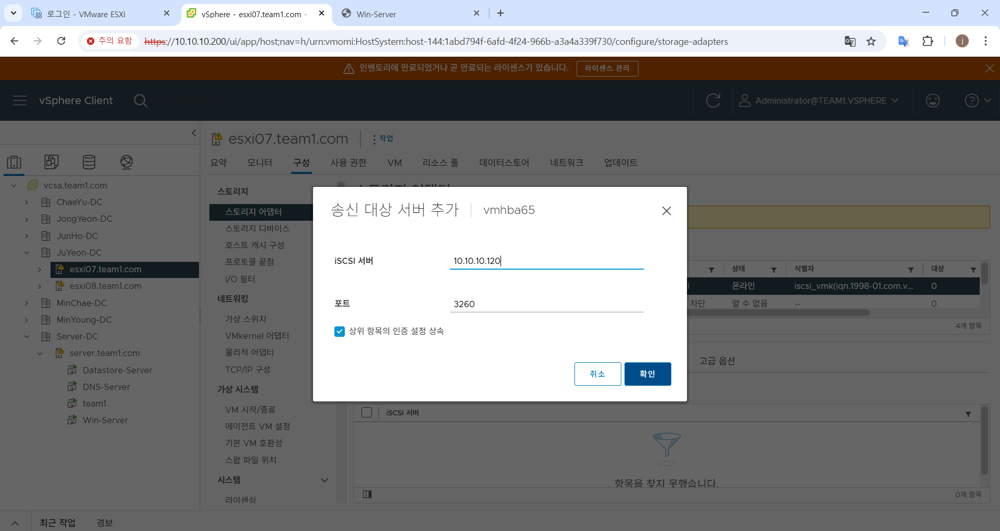
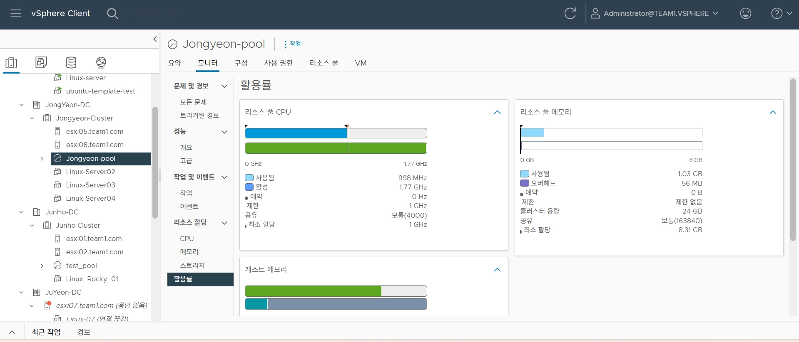
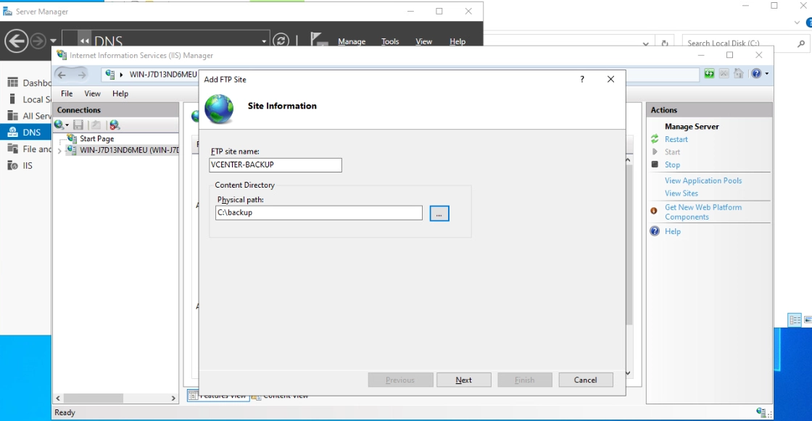
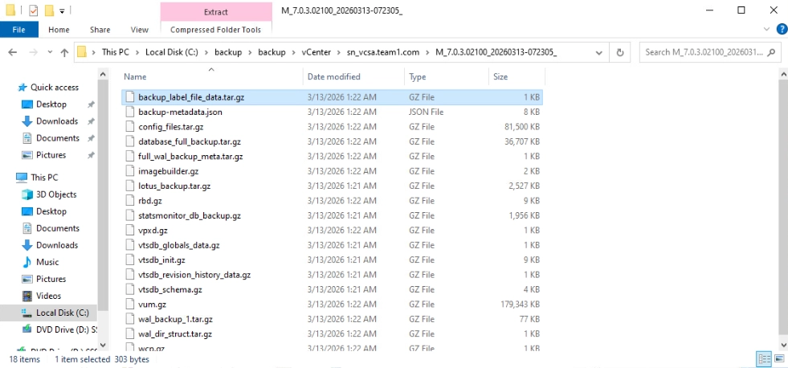
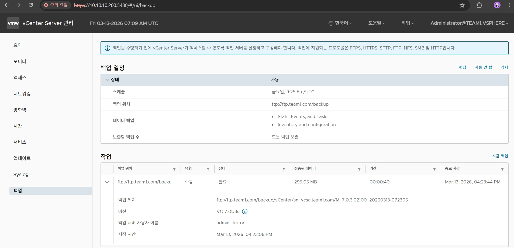
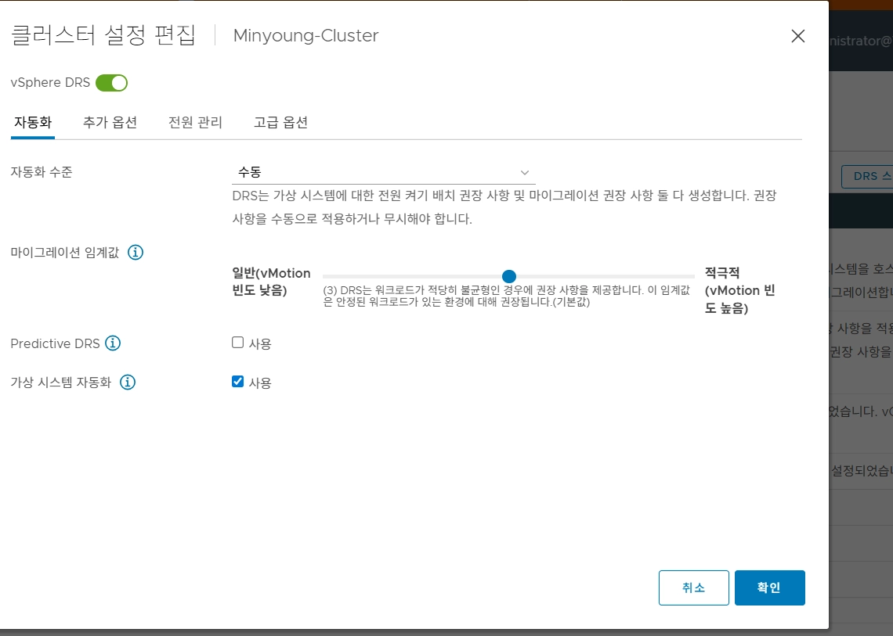
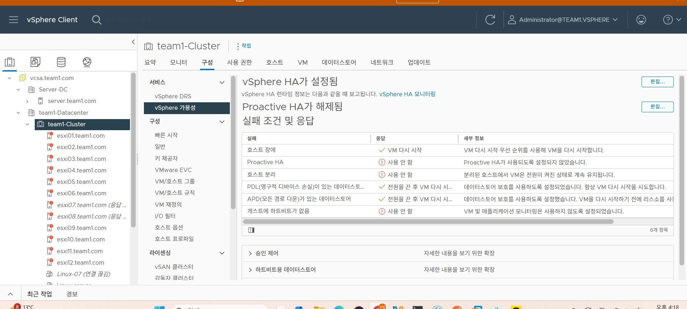
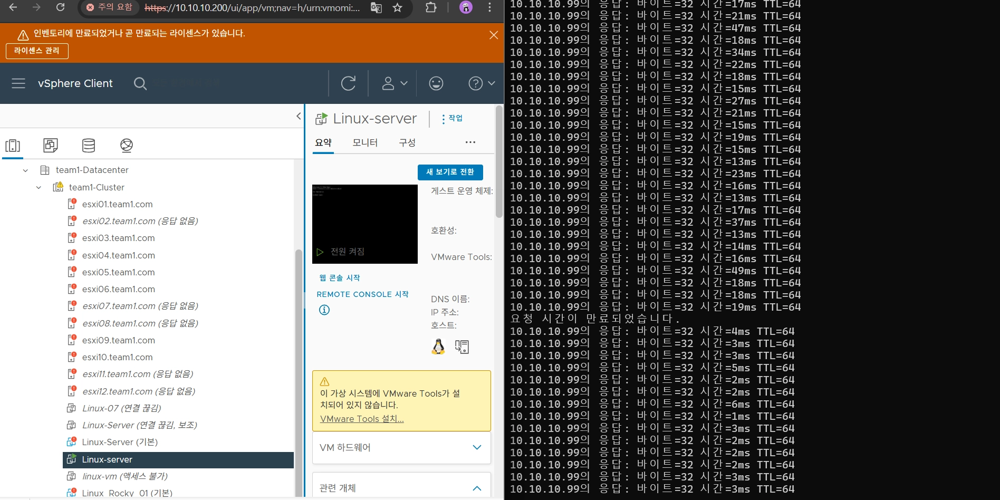

# 🖥️ VMware vSphere 기반 사설 클라우드 인프라 구축

> 단일 장애점을 제거한 **고가용성 데이터센터**를 직접 설계·구축한 팀 프로젝트  
> ESXi 클러스터 · vCenter · 공유 스토리지 · HA/DRS · 고가용성 웹서비스까지 End-to-End 구현


---

## 📐 Architecture

> *(아키텍처 구조도 이미지 삽입)*

---

## 👥 Team Members

|  |  |  |  |  |  |
| :---: | :---: | :---: | :---: | :---: | :---: |
| [강민영](https://github.com/minykang) | [김민채](https://github.com/minchaeki) | [김종연](https://github.com/jongyeon0214) | [백주연](https://github.com/juyeonbaeck) | [이준호](https://github.com/Junhoss) | [이채유](https://github.com/chaeyuuu) |
---

## 📘 Index

- [01 — 인프라 설계 및 환경 세팅](#-day-01--인프라-설계-및-환경-세팅)
- [02 — 가상화 환경 구성 (ESXi + vCenter)](#-day-02--가상화-환경-구성-esxi--vcenter)
- [03 — 공유 스토리지 구성 (iSCSI / NFS)](#-day-03--공유-스토리지-구성-iscsi--nfs)
- [04 — 클러스터 고가용성 (HA / DRS)](#-day-04--클러스터-고가용성-ha--drs)
- [05 — 서비스 배포 및 운영](#-day-05--서비스-배포-및-운영)

---

## 🗓️ 01 — 인프라 설계 및 환경 세팅

> 전체 아키텍처 설계와 팀별 IP 대역 할당, 네트워크 토폴로지 확정

### 1. 목표

물리 서버 위에 ESXi 환경을 구성하고, 이후 모든 실습의 기반이 될 **네트워크 및 스토리지 설계**를 완성하는 것을 목표로 했습니다.

### 2. 주요 구성

- 팀별 IP 대역 및 vCenter 사전 환경 세팅
- Aruba Switch 기반 L2/L3 토폴로지 설계
- Management / Storage / vMotion 트래픽 분리 설계

### 3. 아키텍처 설계 결정

트래픽 간섭을 최소화하기 위해 VMkernel 어댑터를 역할별로 분리하고, 각 호스트가 전용 포트 그룹을 통해서만 해당 트래픽을 처리하도록 설계했습니다.

---

## 🖥️ 02 — 가상화 환경 구성 (ESXi + vCenter)

> ESXi 호스트 설치부터 vCenter 클러스터 등록까지

### 1. ESXi 설치 및 네트워크 설정 (DCUI)

USB 부팅으로 ESXi를 설치하고, DCUI 인터페이스를 통해 Management Network IP를 수동 할당했습니다.

### 2. DNS 등록 및 vCenter 배포

- DNS 서버 구축 후 vCenter FQDN 레코드 사전 등록
- vCenter Server Appliance (vCSA) 배포 및 SSO 도메인 구성

### 3. vCenter 클러스터 구성

- 호스트 3대를 vCenter에 등록하고 Datacenter / Cluster 생성
- ESXi 사용자 계정 생성, 역할 기반 권한 부여
- Lockdown Mode 설정 (Normal / Strict 비교 검토)

> **Lockdown Mode 핵심:** vCenter를 통한 중앙 관리만 허용하고, ESXi 직접 접속(Host Client, SSH)을 차단하여 보안 우회를 방지합니다.

| 모드 | DCUI | Host Client | vCenter |
|------|------|-------------|---------|
| 비활성 | ✅ | ✅ | ✅ |
| Normal | 예외 사용자만 | ❌ | ✅ |
| Strict | ❌ | ❌ | ✅ |

### ⚠️ Troubleshooting

> 관련 트러블슈팅은 [Troubles 폴더](./Troubles)를 참고하세요.

---

## 💾 03. 공유 스토리지 구성 (iSCSI 기반 VMFS)


vSphere 클러스터의 핵심 기능인 **vMotion**과 **HA(High Availability)**를 구현하기 위해, Windows Server를 활용한 iSCSI 공유 스토리지 환경을 구축했습니다.

---

### 1. 개요 및 의사결정 (Storage Strategy)

본 프로젝트에서는 vMotion 및 HA의 핵심인 **공유 스토리지**를 구축하기 위해 NFS(File Storage)와 iSCSI(Block Storage) 방식을 검토했습니다. 최종적으로 엔터프라이즈 환경에서 성능과 데이터 정합성이 뛰어난 **iSCSI(VMFS)** 방식을 채택했습니다.

**📍 NFS vs iSCSI(VMFS) 비교 분석**
| **항목** | **NFS (Network File System)** | **iSCSI (VMFS)** |
| --- | --- | --- |
| **저장소 유형** | **파일 기반** 스토리지 | **블록 기반** 스토리지 |
| **파일 시스템** | 스토리지 서버(OS)가 관리 | **ESXi(VMFS)**가 직접 관리 |
| **데이터 정합성** | 파일 잠금(File Locking) 방식 | **분산 잠금(Distributed Locking)** |
| **성능 특성** | 구성이 간편하나 오버헤드 존재 | 로컬 디스크와 유사한 고성능 I/O |
| **주요 장점** | 다중 호스트 연결이 매우 직관적임 | 가상화 최적화 기능(VAAI 등) 지원 |

### 📍 iSCSI(VMFS) 채택 사유

1. **VMFS 6의 기술적 우위:** VMFS는 여러 호스트가 동시에 읽고 쓰기를 수행할 때 발생할 수 있는 데이터 충돌을 방지하는 **Distributed Locking** 메커니즘을 내장하고 있어, 클러스터 환경에서 데이터 무결성을 완벽하게 보장합니다.
2. **고성능 워크로드 지원:** 블록 레벨의 데이터 전송을 통해 오버헤드를 줄여, 실제 운영 환경의 DB나 고부하 VM 운영에 더 적합하다고 판단했습니다.
3. **고급 기능 활용:** vSphere의 하드웨어 가속(VAAI) 기능을 활용하여 스토리지 작업의 부하를 네트워크가 아닌 스토리지 레벨에서 처리할 수 있는 확장성을 고려했습니다.

---

### 2. Windows Server: iSCSI Target 설정

Windows Server를 '하드디스크를 빌려주는 주인'으로 만드는 과정입니다.

### 📍 Step 1: iSCSI 대상 서버 역할 설치

1. **서버 관리자** 실행 → [관리] → [역할 및 기능 추가].
2. `파일 및 저장소 서비스` > `파일 및 iSCSI 서비스` > **[iSCSI 대상 서버]** 체크 후 설치.


### 📍 Step 2: iSCSI 가상 디스크 및 대상(Target) 지정

1. **가상 디스크 생성:** 300GB 용량의 `.vhdx` 파일을 생성합니다.
2. **접근 권한(IQN) 등록:** 각 ESXi 호스트의 고유 식별자인 **IQN**을 등록하여 지정된 호스트만 스토리지를 점유할 수 있도록 보안을 설정합니다.
    
    > **IQN이란?** `iqn.1998-01.com.vmware:esxi-01` 처럼 IP가 바뀌어도 장치를 식별할 수 있는 고유 주소입니다.
    > 

---

### 3. ESXi: iSCSI Initiator 연결 및 VMFS 구성

각 ESXi 호스트에서 네트워크를 통해 300GB 디스크를 '내 것'처럼 인식시키는 과정입니다.

### 📍 Step 1: 어댑터 활성화 및 네트워크 바인딩

- [스토리지] > [어댑터] > **[소프트웨어 iSCSI 추가]**를 클릭합니다.


- **Port Binding:** 스토리지 전용 VMkernel 포트를 어댑터에 바인딩하여 관리 트래픽과의 간섭을 차단합니다.


### 📍 Step 2: Dynamic Discovery & Storage Rescan

Windows Server가 공유해준 300GB 디스크를 ESXi 호스트가 네트워크 너머에서 '발견'하도록 유도하는 단계입니다.

- **동적 검색(Dynamic Discovery):** iSCSI 대상 서버의 IP(**10.10.10.2**)와 기본 포트(**3260**)를 입력합니다. 이 과정에서 ESXi는 서버에 접속하여 나에게 할당된 LUN(Logical Unit Number) 목록을 자동으로 받아옵니다.

- **스토리지 다시 검사(Rescan Storage):** 단순히 대상을 등록하는 것만으로는 디스크가 나타나지 않습니다. '다시 검사'를 실행하여 HBA(Host Bus Adapter)가 새로운 경로를 탐색하고, 운영체제가 장치를 인식하도록 강제합니다.

- **인식 확인:** 정상적으로 연결되면 장치 목록에 `MSFT iSCSI Disk`라는 모델명과 함께 정확히 **300GB**의 사용 가능한 용량이 표시됩니다.

---

### 📍 Step 3: VMFS 6 데이터스토어 구성 (File System Strategy)

인식된 가공되지 않은(Raw) 디스크를 vSphere가 데이터를 저장할 수 있는 최적의 상태로 포맷합니다.


- **파티션 최적화:** '모든 사용 가능한 공간 사용'을 선택하여 300GB 전체를 하나의 거대한 컨테이너로 활용합니다. 이는 향후 VM 생성 시 용량 부족 문제를 방지하고 디스크 단편화를 줄여줍니다.

---

## ⚙️ 04 — 클러스터 고가용성 (HA / DRS)

> 장애 자동 복구와 리소스 로드밸런싱으로 무중단 운영 환경 구성

### 1. Resource Pool

- 팀/서비스 단위로 CPU·메모리 자원을 논리적으로 격리
- Shares / Reservation / Limit 3단계 정책 적용
#### 1. 설계 및 설정 목적
* **자원 보호:** 특정 VM이 과도하게 자원을 사용하여 운영 환경 VM의 성능을 저하시키는 'Noisy Neighbor' 현상 방지.
* **성능 보장:** 핵심 서비스 가동에 필요한 최소한의 하드웨어 성능을 물리적으로 예약하여 서비스 안정성 확보.

#### 2. 주요 설정 항목 및 실습 내용 (이미지 기반 분석)

| 설정 항목 | 실습 적용 내용 및 의미 |
| :--- | :--- |
| **Shares (공유)** |  자원 부족 시 타 리소스 풀 대비 상대적인 가중치를 결정합니다. |
| **Reservation (예약)** |  VM 구동을 위해 클러스터에서 물리적으로 점유를 확정 짓는 최소 보장 자원입니다. |
| **Limit (제한)** | CPU 1 GHz  설정. 해당 풀 내 VM들이 사용할 수 있는 최대치입니다. CPU를 1GHz로 묶어 자원 독식을 방지했습니다. |

#### 3. 설정 프로세스 (vSphere Client)

1. **리소스 풀 생성:** vSphere Cluster 우측 클릭 → 새 리소스 풀(New Resource Pool) 선택.
2. **이름 정의:** 실습 환경 식별을 위해 username-pool로 명명.
3. **리소스 할당 정책 수립:**
    * **CPU Limit:** 1 GHz 를 입력하여 해당 풀의 최대 연산 능력을 제한.
    * **Expandable Reservation:** 체크박스를 선택하여, 자원 고갈 시 부모 풀에서 유연하게 자원을 빌려올 수 있도록 설정.
4. **VM 배치:** 대상 VM(Linux-Server02~04)을 생성된 리소스 풀로 이동하여 정책 적용 확인.

#### 4. 실습 결과 모니터링 및 인사이트



* **제한 정책의 실효성:** 위 스크린샷의 활용률 차트를 보면, CPU 사용량이 **998 MHz**로 측정되어 설정한 **제한치(1 GHz)** 내에서 안정적으로 제어되고 있음을 확인했습니다.
* **자원 분배 효율:** 예약 자원은 0이지만, 최소 할당량(8.31 GB)이 확보되어 물리 호스트의 자원을 효율적으로 공유하면서도 개별 VM의 기동성을 유지하고 있습니다.

---

### 2. vCenter 백업 (VAMI)

- `https://{vcenter-ip}:5480` 접근 → 백업 스케줄 설정
- FTP 서버를 백업 위치로 지정하여 정기 자동 백업

#### 1. 설계 및 설정 목적
* **재해 복구(DR):** vCenter 서버 자체의 결함이나 데이터 손상 시, 백업본을 통해 인벤토리 및 네트워크 설정을 신속히 복구하기 위함입니다.
* **리스크 관리:** 클러스터 고도화 설정(DRS, HA 등)을 적용하기 전, 시스템의 '골든 이미지' 상태를 보존합니다.

#### 2. 주요 설정 항목 및 실습 내용 

| 항목 | 실습 적용 내용 및 의미 |
| :--- | :--- |
| **백업 위치 (Location)** | ftp://ftp.team1.com/backup 설정. 인프라 내 DNS 서버를 백업 저장소로 활용합니다. |
| **백업 일정 (Schedule)** |  데이터 변경 사항을 매일 반영하여 복구 시점 목표(RPO)를 최적화합니다. |
| **저장소 구축** | **DNS-Server C:\backup**. 별도의 스토리지 대신 운영 중인 윈도우 서버에 FTP 서비스를 올려 백업 서버로 변환했습니다. |

#### 3. 설정 프로세스 상세

#### ① 백업 저장소(FTP 서버) 준비 및 폴더 구성


1. **물리 경로 확보:** DNS 서버의 `C:\` 드라이브에 `backup`이라는 이름의 폴더를 생성합니다.
2. **FTP 서비스 활성화:** 해당 서버에 IIS(Internet Information Services)를 구성하고, 생성한 폴더를 루트 경로로 지정하여 외부(vCenter)에서 접근 가능하도록 설정합니다.

#### ② VAMI 접속 및 자동 백업 스케줄링

1. **관리 포털 접속:** https://10.10.10.200{vcenter-ip}:5480 (VAMI) 포트를 통해 vCenter 관리 인터페이스에 로그인합니다.
2. **백업 구성:** `Backup` 메뉴에서 생성한 FTP 서버 주소, 계정 정보, 백업 주기를 입력합니다.
3. **연동 테스트:** 설정 완료 후 즉시 백업(Backup Now)을 실행하여 DNS 서버의 `C:\backup` 폴더에 데이터가 정상적으로 전송되는지 확인합니다.

#### 4. 실습 결과 및 인사이트
* **중앙 집중식 보호:** 개별 VM 백업 외에도 인프라의 '두뇌' 역할을 하는 vCenter를 별도 서버(DNS 서버)에 백업함으로써 이중 안전장치를 마련했습니다.
* **복구 자동화 기반:** 매일 정해진 시간에 백업이 수행되도록 자동화함으로써, 관리자의 수동 작업 없이도 항상 최신 상태의 복구본을 유지할 수 있게 되었습니다.

---


### 3. DRS (Distributed Resource Scheduler)

클러스터 내 ESXi 호스트 간 부하를 지속 모니터링하고, 리소스 불균형 발생 시 VM을 자동 마이그레이션합니다.

- 자동화 수준: Manual / Partially Automated / Fully Automated
- Affinity / Anti-Affinity 규칙으로 VM 배치 정책 제어

#### 1. 설계 및 설정 목적
* **부하 평준화:** 특정 호스트에만 VM이 몰려 발생하는 성능 저하(Resource Contention) 방지 및 자원 효율 극대화.
* **운영 자동화:** 관리자의 개입 없이 vCenter가 실시간 리소스 상태를 분석하여 VM을 최적의 위치에 배치.
* **가용성 전략 수립:** 배치 규칙(Affinity)을 통해 물리적 호스트 장애 시 서비스 전체가 중단되는 리스크를 사전 관리.

#### 2. 주요 설정 항목 및 옵션 상세 분석


| 설정 항목 | 옵션 종류 및 상세 설명 |
| :--- | :--- |
| **자동화 수준 (Automation Level)** | 1. 수동(Manual): 배치 및 마이그레이션 권장 사항만 생성하며, 실행은 관리자가 승인.<br>2. 일부 자동(Partially Automated) 초기 배치만 자동이며, 운영 중 이동은 관리자 승인 필요.<br>3. 완전 자동(Fully Automated): 배치 및 마이그레이션 전 과정을 vCenter가 자동으로 수행. |
| **마이그레이션 임계값 (Threshold)** | 1단계(보수적) ~ 5단계(적극적): 단계가 높을수록 작은 불균형에도 빈번하게 vMotion을 발생시킴. 보통 **3단계(기본값)**를 적용하여 불필요한 네트워크 부하와 성능 최적화 사이의 균형을 유지함. |
| **vSphere DRS** | **활성(Turn On):** 클러스터 단위의 리소스 스케줄링 기능을 활성화하여 호스트 간 자원 공유 체계 구축. |

#### 3. 설정 프로세스 상세

#### ① DRS 정책 수립 및 자동화 설정

1. **클러스터 편집:** vSphere Client에서 대상 클러스터(username-Cluster) 우측 클릭 → 설정 편집 진입.
2. **자동화 수준 지정:** 실습에서는 DRS의 동작 원리를 명확히 확인하기 위해 자동화 모드를 검토한 후, 운영 효율을 위해 완전 자동(Fully Automated)으로의 전환 가능성을 학습함.
3. **마이그레이션 진행:** 마이그레이션 임계값을 기본값인 **3단계**로 설정하여 워크로드가 눈에 띄게 불균형할 때만 이동이 발생하도록 구성함.

#### ② VM 배치 규칙 설정 (Affinity / Anti-Affinity)
*물리적 서버 장애에 대비하여 다음과 같은 논리적 배치 규칙을 적용함.*
1. **Affinity:** 잦은 통신이 발생하는 서버(예: App-DB)를 동일 호스트에 두어 내부 네트워크 속도 향상.
2. **Anti-Affinity:** 동일한 역할을 하는 이중화 서버(예: Web-01, Web-02)를 서로 다른 호스트에 강제 분산. 이는 특정 호스트 다운 시 서비스 전체가 중단되는 SPOF(Single Point of Failure)를 방지하는 핵심 가용성 설정임.

#### 4. 실습 결과 및 인사이트
* **지능적 배치 메커니즘:** DRS 활성화 시 특정 호스트에 자원 경합이 발생하면, vCenter가 즉시 유휴 자원이 있는 호스트로의 이동 권장 사항을 생성하는 것을 확인함.
* **운영 안정성 확보:** 배치 규칙(Anti-Affinity)을 통해 인프라의 물리적 구조와 상관없이 서비스의 논리적 연속성을 보장할 수 있는 설계 역량을 배양함.

---
### 4. HA (High Availability)

ESXi 호스트 장애 감지 시 해당 호스트의 VM을 클러스터 내 다른 호스트에서 자동 재시작합니다.

- Admission Control 정책으로 장애 대응 여유 리소스 예약
- VM 재시작 우선순위 및 모니터링 설정


#### 1. 설계 및 설정 목적
* **하드웨어 장애 대응:** 서버 전원 불능, 마더보드 고장 등 물리적 장애 시 서비스 수동 복구에 걸리는 시간 제거.
* **자동화된 복구:** 관리자의 개입 없이 시스템 스스로 장애를 감지하고 VM을 다시 기동하여 가용성(Availability) 확보.

#### 2. 주요 설정 항목 및 장애 응답 분석

| 항목 | 설정 및 실습 내용 |
| :--- | :--- |
| **호스트 장애** | VM 다시 시작. 호스트 다운 감지 시 즉시 타 호스트에서 VM 재기동 프로세스 수행. |
| **데이터스토어 보호** | PDL(영구적 디바이스 손실) 및 APD(모든 경로 다운) 발생 시 VM 재시작. 스토리지 연결 장애 시에도 서비스 연속성 보장. |
| **승인 제어 (Admission Control)** | 호스트 장애 시 남은 자원이 VM들을 수용할 수 있는지 상시 체크하여 복구 신뢰성 확보. |

#### 3. 설정 및 검증 프로세스

#### ① vSphere HA 활성화 및 모니터링 설정

1. **HA 사용 설정:** 클러스터 설정의 vSphere 가용성 메뉴에서 vSphere HA를 **설정됨(Turn On)** 상태로 변경합니다.
2. **장애 조건 정의:** 호스트 장애, 데이터스토어 연결 장애 등에 대한 응답 방식을 설정합니다. 화면과 같이 'VM 다시 시작'이 활성화되어 있어야 자동 복구가 가능합니다.

#### ② 고가용성 검증 테스트 (Ping Test)

1. **연속 핑 실행:** 외부 호스트에서 클러스터 내 VM(`Linux-server`)의 IP로 `ping -t` 명령을 실행하여 통신 상태를 실시간 모니터링합니다.
2. **강제 장애 유발:** 해당 VM이 구동 중인 물리 호스트의 전원을 강제로 차단하거나 네트워크를 단절시켜 장애 상황을 연출합니다.
3. **복구 확인:** - 사진 우측의 터미널 화면을 보면, 장애 발생 직후 '요청 시간이 만료되었습니다'라는 메시지와 함께 잠시 통신이 끊깁니다.
    - 약 수십 초 후, HA 메커니즘에 의해 VM이 타 호스트에서 재기동되자 다시 응답(Reply) 데이터가 들어오는 것을 확인할 수 있습니다.
    - 이를 통해 관리자의 수동 개입 없이 서비스가 성공적으로 자동 복구되었음을 증명합니다.

#### 4. 실습 결과 및 인사이트
* **서비스 연속성 입증:** 실제 장애 시나리오를 통해 HA의 작동 원리를 확인하였으며, 복구 과정에서의 패킷 손실 구간을 통해 서비스 가동 시간(Uptime)을 수치적으로 파악할 수 있었습니다.
* **인프라 설계 역량:** 앞선 1~3단계(Resource Pool, VAMI, DRS)가 뒷받침되어야 HA가 안정적으로 가동될 수 있음을 이해하였으며, 엔터프라이즈 급 가상화 환경 구축의 전 과정을 완수했습니다.

---

## 🚀 05 — 서비스 배포 및 운영

> 표준화된 템플릿 기반 VM 배포와 고가용성 웹서비스 구축

### 1. Linux 마스터 템플릿 제작

반복 배포를 위한 읽기 전용 마스터 이미지를 제작했습니다.

```bash
# OS 식별 정보 초기화 (Ubuntu 기준)
apt clean && apt autoremove -y
cloud-init clean
rm -f /etc/ssh/ssh_host_*
truncate -s 0 /etc/machine-id
cat /dev/null > ~/.bash_history && history -c && poweroff
```

- vCenter 사용자 지정 규격으로 배포 시 IP / 호스트명 자동 주입
- VMware Tools 설치 필수

### 2. NFS 기반 고가용성 웹서비스 구축

- NFS 공유 스토리지에 웹 콘텐츠를 올려 모든 웹 서버 VM이 동일한 데이터를 바라보도록 구성
- ESXi HA와 결합하여 노드 장애 시 서비스 자동 복구

### 3. NTP 서버 동기화

- Windows Server를 NTP 서버로 구성
- 전체 ESXi 호스트 시간 동기화 적용

---

## 🛠️ 기술 스택

| 분류 | 기술 |
|------|------|
| 하이퍼바이저 | VMware ESXi 8.x |
| 가상화 관리 | VMware vCenter Server |
| 공유 스토리지 | Windows Server iSCSI Target |
| 스토리지 프로토콜 | iSCSI (VMFS), NFS |
| 네트워크 | Aruba Switch, VMkernel, vSwitch |
| OS | Windows Server 2022, Ubuntu Server |
| 기타 | VAMI 백업, NTP, Lockdown Mode |

---

## 📁 전체 챕터 목록

<details>
<summary>펼치기 (25개)</summary>

| # | 제목 |
|---|------|
| 01 | 팀 기본 세팅 (IP 할당 / vCenter 정보) |
| 02 | 아키텍처 구조도 |
| 03 | 네트워크 구성 (Aruba Switch Topology) |
| 04 | ESXi VM 생성 및 사양 설정 |
| 05 | ESXi 설치 및 IP 할당 (DCUI) |
| 06 | DNS 및 호스트명 설정 |
| 07 | vCenter에 호스트 등록 및 DC 구성 |
| 08 | ESXi 사용자 계정 생성 및 권한 부여 |
| 09 | 잠금 모드 (Lockdown Mode) |
| 10 | Shared Datastore 종류 (NFS vs VMFS/iSCSI) |
| 11 | 가상화 인프라 구성 요소 (Who's who?) |
| 12 | ESXi 호스트별 네트워크 설정 (VMkernel / vSwitch) |
| 13 | vSphere 공유 스토리지 유형 상세 정리 |
| 14 | 데이터스토어 자동 전파 원리 (3가지 이유) |
| 15 | vCenter SSH 활성화 (VAMI) |
| 16 | Windows Server NTP 서버 설정 |
| 17 | Windows Server iSCSI Target 설정 (2단계) |
| 18 | ESXi iSCSI 연결 및 VMFS 데이터스토어 생성 |
| 19 | ESXi 가상 네트워크 계층 구조 상세 |
| 20 | vCenter 백업 설정 (FTP 서버 활용) |
| 21 | 클러스터 설정 — DRS |
| 22 | 클러스터 설정 — HA |
| 23 | Resource Pool 설정 및 활용 |
| 24 | Linux 마스터 템플릿 제작 및 배포 |
| 25 | NFS 기반 고가용성 공유 웹 서비스 구축 |

</details>

---

*본 프로젝트는 실습 환경에서 진행된 인프라 구축 기록입니다.*
