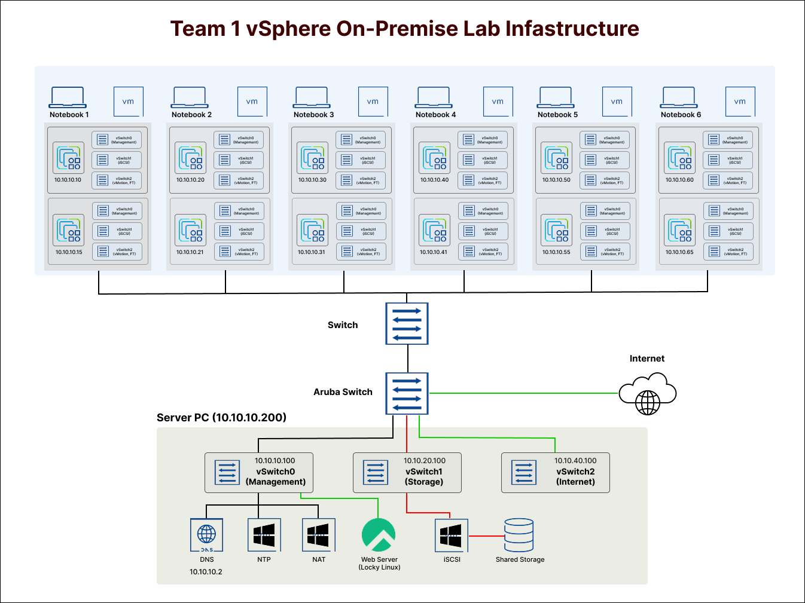

# 🖥️ VMware vSphere 기반 사설 클라우드 인프라 구축

> 단일 장애점을 제거한 **고가용성 데이터센터**를 직접 설계·구축한 팀 프로젝트  
> ESXi 클러스터 · vCenter · 공유 스토리지 · HA/DRS · 고가용성 웹서비스까지 End-to-End 구현


---

## 👥 Team Members

|  |  |  |  |  |  |
| :---: | :---: | :---: | :---: | :---: | :---: |
| [강민영](https://github.com/minykang) | [김민채](https://github.com/minchaeki) | [김종연](https://github.com/jongyeon0214) | [백주연](https://github.com/juyeonbaeck) | [이준호](https://github.com/Junhoss) | [이채유](https://github.com/chaeyuuu) |
---

## 📘 Index

- [01 — 인프라 설계 및 환경 세팅](#-day-01--인프라-설계-및-환경-세팅)
- [02 — 가상화 환경 구성 (ESXi + vCenter)](#-day-02--가상화-환경-구성-esxi--vcenter)
- [03 — 공유 스토리지 구성 (iSCSI / NFS)](#-day-03--공유-스토리지-구성-iscsi--nfs)
- [04 — 클러스터 고가용성 (HA / DRS)](#-day-04--클러스터-고가용성-ha--drs)
- [05 — 서비스 배포 및 운영](#-day-05--서비스-배포-및-운영)

---

## 📐 Architecture



---

## 🗓️ 01 — 인프라 설계 및 환경 세팅

> 전체 아키텍처 설계와 팀별 IP 대역 할당, 네트워크 토폴로지 확정

### 1. 목표

물리 서버 위에 ESXi 환경을 구성하고, 이후 모든 실습의 기반이 될 **네트워크 및 스토리지 설계**를 완성하는 것을 목표로 했습니다.

### 2. 주요 구성

- 팀별 IP 대역 및 vCenter 사전 환경 세팅
- Aruba Switch 기반 L2/L3 토폴로지 설계
- Management / Storage / vMotion 트래픽 분리 설계

### 3. 아키텍처 설계 결정

트래픽 간섭을 최소화하기 위해 VMkernel 어댑터를 역할별로 분리하고, 각 호스트가 전용 포트 그룹을 통해서만 해당 트래픽을 처리하도록 설계했습니다.

---

## 🖥️ 02 — 가상화 환경 구성 (ESXi + vCenter)

> ESXi 호스트 설치부터 vCenter 클러스터 등록까지

### 1. ESXi 설치 및 네트워크 설정 (DCUI)

USB 부팅으로 ESXi를 설치하고, DCUI 인터페이스를 통해 Management Network IP를 수동 할당했습니다.

### 2. DNS 등록 및 vCenter 배포

- DNS 서버 구축 후 vCenter FQDN 레코드 사전 등록
- vCenter Server Appliance (vCSA) 배포 및 SSO 도메인 구성

### 3. vCenter 클러스터 구성

- 호스트 3대를 vCenter에 등록하고 Datacenter / Cluster 생성
- ESXi 사용자 계정 생성, 역할 기반 권한 부여
- Lockdown Mode 설정 (Normal / Strict 비교 검토)

> **Lockdown Mode 핵심:** vCenter를 통한 중앙 관리만 허용하고, ESXi 직접 접속(Host Client, SSH)을 차단하여 보안 우회를 방지합니다.

| 모드 | DCUI | Host Client | vCenter |
|------|------|-------------|---------|
| 비활성 | ✅ | ✅ | ✅ |
| Normal | 예외 사용자만 | ❌ | ✅ |
| Strict | ❌ | ❌ | ✅ |

### ⚠️ Troubleshooting

> 관련 트러블슈팅은 [Troubles 폴더](./Troubles)를 참고하세요.

---

## 💾 03 — 공유 스토리지 구성 (iSCSI / NFS)

> 모든 ESXi 호스트가 동일한 스토리지를 공유하는 환경 구성 — vMotion · HA의 필수 전제 조건

### 1. Windows Server iSCSI Target 설정

- Windows Server에서 iSCSI Target 역할 추가 및 가상 디스크(VHD) 생성
- 이니시에이터 IQN 등록 및 접근 권한 부여

### 2. ESXi iSCSI Initiator 연결 및 VMFS 데이터스토어 생성

- 각 ESXi 호스트에서 소프트웨어 iSCSI 어댑터 추가
- Storage 전용 VMkernel에 포트 바인딩하여 트래픽 격리
- Dynamic Discovery로 Target 등록 → LUN 인식 → VMFS 6 데이터스토어 생성

### 3. NFS 공유 스토리지

- NFS Share 마운트 → ESXi 전체 호스트 자동 전파
- 데이터스토어 자동 전파 원리 (vCenter 중앙 관리 / 동일 스토리지 구독 / 클러스터 내 공유 정책)

### iSCSI vs NFS 비교

| 항목 | iSCSI (VMFS) | NFS |
|------|-------------|-----|
| 프로토콜 계층 | 블록 스토리지 | 파일 스토리지 |
| 동시 접근 | 단일 호스트 전용 | 다중 호스트 동시 가능 |
| 주요 용도 | 고성능 VM 워크로드 | 공유 템플릿 · ISO 배포 |

---

## ⚙️ 04 — 클러스터 고가용성 (HA / DRS)

> 장애 자동 복구와 리소스 로드밸런싱으로 무중단 운영 환경 구성

### 1. HA (High Availability)

ESXi 호스트 장애 감지 시 해당 호스트의 VM을 클러스터 내 다른 호스트에서 자동 재시작합니다.

- Admission Control 정책으로 장애 대응 여유 리소스 예약
- VM 재시작 우선순위 및 모니터링 설정

### 2. DRS (Distributed Resource Scheduler)

클러스터 내 ESXi 호스트 간 부하를 지속 모니터링하고, 리소스 불균형 발생 시 VM을 자동 마이그레이션합니다.

- 자동화 수준: Manual / Partially Automated / Fully Automated
- Affinity / Anti-Affinity 규칙으로 VM 배치 정책 제어

### 3. Resource Pool

- 팀/서비스 단위로 CPU·메모리 자원을 논리적으로 격리
- Shares / Reservation / Limit 3단계 정책 적용

### 4. vCenter 백업 (VAMI)

- `https://{vcenter-ip}:5480` 접근 → 백업 스케줄 설정
- FTP 서버를 백업 위치로 지정하여 정기 자동 백업

---

## 🚀 05 — 서비스 배포 및 운영

> 표준화된 템플릿 기반 VM 배포와 고가용성 웹서비스 구축

### 1. Linux 마스터 템플릿 제작

반복 배포를 위한 읽기 전용 마스터 이미지를 제작했습니다.

```bash
# OS 식별 정보 초기화 (Ubuntu 기준)
apt clean && apt autoremove -y
cloud-init clean
rm -f /etc/ssh/ssh_host_*
truncate -s 0 /etc/machine-id
cat /dev/null > ~/.bash_history && history -c && poweroff
```

- vCenter 사용자 지정 규격으로 배포 시 IP / 호스트명 자동 주입
- VMware Tools 설치 필수

### 2. NFS 기반 고가용성 웹서비스 구축

- NFS 공유 스토리지에 웹 콘텐츠를 올려 모든 웹 서버 VM이 동일한 데이터를 바라보도록 구성
- ESXi HA와 결합하여 노드 장애 시 서비스 자동 복구

### 3. NTP 서버 동기화

- Windows Server를 NTP 서버로 구성
- 전체 ESXi 호스트 시간 동기화 적용

---

## 🛠️ 기술 스택

| 분류 | 기술 |
|------|------|
| 하이퍼바이저 | VMware ESXi 8.x |
| 가상화 관리 | VMware vCenter Server |
| 공유 스토리지 | Windows Server iSCSI Target |
| 스토리지 프로토콜 | iSCSI (VMFS), NFS |
| 네트워크 | Aruba Switch, VMkernel, vSwitch |
| OS | Windows Server 2022, Ubuntu Server |
| 기타 | VAMI 백업, NTP, Lockdown Mode |

---

## 📁 전체 챕터 목록

<details>
<summary>펼치기 (25개)</summary>

| # | 제목 |
|---|------|
| 01 | 팀 기본 세팅 (IP 할당 / vCenter 정보) |
| 02 | 아키텍처 구조도 |
| 03 | 네트워크 구성 (Aruba Switch Topology) |
| 04 | ESXi VM 생성 및 사양 설정 |
| 05 | ESXi 설치 및 IP 할당 (DCUI) |
| 06 | DNS 및 호스트명 설정 |
| 07 | vCenter에 호스트 등록 및 DC 구성 |
| 08 | ESXi 사용자 계정 생성 및 권한 부여 |
| 09 | 잠금 모드 (Lockdown Mode) |
| 10 | Shared Datastore 종류 (NFS vs VMFS/iSCSI) |
| 11 | 가상화 인프라 구성 요소 (Who's who?) |
| 12 | ESXi 호스트별 네트워크 설정 (VMkernel / vSwitch) |
| 13 | vSphere 공유 스토리지 유형 상세 정리 |
| 14 | 데이터스토어 자동 전파 원리 (3가지 이유) |
| 15 | vCenter SSH 활성화 (VAMI) |
| 16 | Windows Server NTP 서버 설정 |
| 17 | Windows Server iSCSI Target 설정 (2단계) |
| 18 | ESXi iSCSI 연결 및 VMFS 데이터스토어 생성 |
| 19 | ESXi 가상 네트워크 계층 구조 상세 |
| 20 | vCenter 백업 설정 (FTP 서버 활용) |
| 21 | 클러스터 설정 — DRS |
| 22 | 클러스터 설정 — HA |
| 23 | Resource Pool 설정 및 활용 |
| 24 | Linux 마스터 템플릿 제작 및 배포 |
| 25 | NFS 기반 고가용성 공유 웹 서비스 구축 |

</details>

---

*본 프로젝트는 실습 환경에서 진행된 인프라 구축 기록입니다.*
